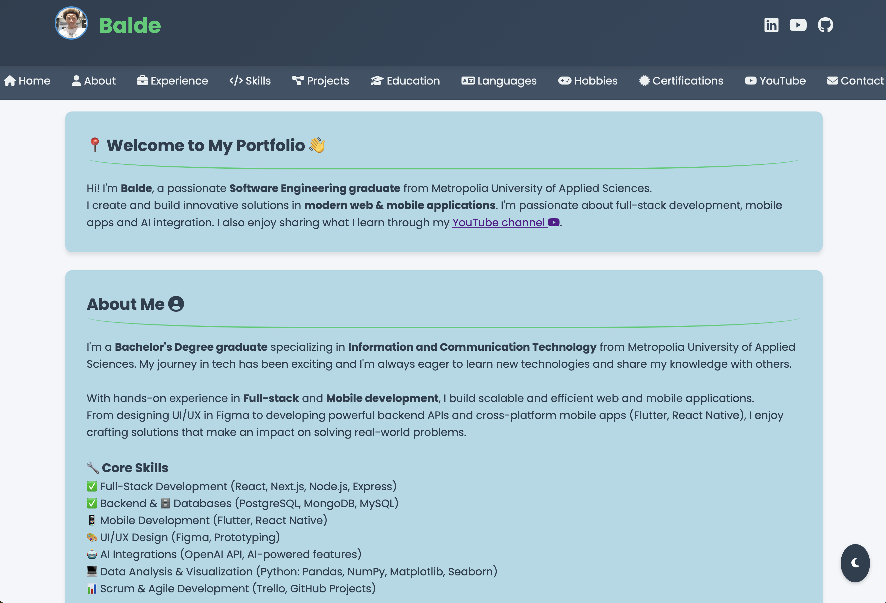

# 🚀 Balde's Portfolio

A modern, responsive and feature-rich personal portfolio website showcasing my skills, experience and projects as a **Software Engineering graduate** from Metropolia University of Applied Sciences.

## 🎨 Portfolio Preview

My portfolio upper section page screenshot from web site link: [Balde's Portfolio](https://baldez300.github.io/baldez-website/)



## 📋 Table of Contents

- [Overview](#overview)
- [Features](#features)
- [Technologies Used](#technologies-used)
- [Sections](#sections-breakdown)
- [Getting Started](#getting-started)
- [Project Structure](#project-structure)
- [Skills & Expertise](#skills--expertise)
- [How to Customize](#how-to-customize)
- [Deployment](#deployment)
- [Contact](#contact--social-links)
- [License](#license)
- [Acknowledgments](#acknowledgments)
- [Version History](#version-history)

---

## Overview

🎯 This portfolio is designed for **recruiters, clients and fellow developers** who want to learn more about my professional background, technical skills and project portfolio. It serves as both a **personal brand** and a **learning resource** for anyone interested in building their own portfolio website.

### Who is this for?
- **Recruiters** - Explore my experience, skills and completed projects
- **Potential Clients** - View my project portfolio and technical capabilities
- **Developers** - Learn from the code structure and responsive design implementation
- **Students** - Use this as a template or reference for creating your own portfolio

---

## Features

### 🎨 User Experience
- ✅ **Responsive Design** - Works perfectly on desktop, tablet and mobile devices
- ✅ **Dark Mode Toggle** - Switch between light and dark themes with persistent storage
- ✅ **Smooth Scrolling** - Elegant navigation between sections
- ✅ **Mobile Menu** - Hamburger menu for mobile devices
- ✅ **Hover Effects** - Interactive animations and transitions

### 📱 Core Sections
- **Home** - Welcome section with quick introduction
- **About Me** - Detailed background and core skills overview
- **Experience** - Internship and project experiences with detailed descriptions
- **Skills** - Comprehensive skills organized by category (Front-end, Back-end, Mobile, Databases, CI/CD, DevOps, etc.)
- **Projects** - Showcase of completed projects with descriptions and GitHub links
- **Education** - Academic background and study projects
- **Languages** - Multilingual proficiency levels
- **Hobbies** - Personal interests and activities
- **Certifications** - Professional certifications with badge images and descriptions
- **YouTube** - Embedded YouTube channel showcase
- **Contact** - Contact form placeholder

### 🔧 Technical Features
- **SEO Optimized** - Meta tags for better search engine visibility
- **Google Fonts Integration** - Professional typography with Poppins font
- **Font Awesome Icons** - Extensive icon library for visual enhancement
- **LocalStorage** - Dark mode preference persistence
- **Smooth Navigation** - Offset-aware smooth scrolling

---

## Technologies Used

### Frontend
- **HTML5** - Semantic markup structure
- **CSS3** - Advanced styling with CSS variables and media queries
- **JavaScript (Vanilla)** - No frameworks, pure JavaScript for interactivity

### Icons & Fonts
- **Font Awesome 6.4.0** - Icon library
- **Google Fonts** - Poppins font family

### 🌐 Deployment
- **GitHub Pages** - Static site hosting
- **Vercel** - Alternative deployment option Or other hosting services like `Netlify`

---

## Sections Breakdown

### 1. **Header & Navigation**
- Fixed header with logo, name and social media links (LinkedIn, YouTube, GitHub)
- Responsive navigation bar with smooth scrolling
- Mobile hamburger menu for smaller screens

### 2. **Home Section**
Quick introduction highlighting:
- Professional background
- Key focus areas (full-stack, mobile, AI)
- Link to YouTube channel

### 3. **About Me**
- Bachelor's Degree information
- Core competencies overview
- Quick info card (Location, Driver's License)

### 4. **Experience**
Two main subsections:
- **Internship Experience** - Professional internship at herizon.io
- **Project Experience** - Multidisciplinary innovation projects

### 5. **Skills**
Organized by categories:
- Front-end (HTML5, CSS3, JavaScript, React, Next.js, TypeScript)
- Mobile Development (Flutter, Dart, React Native, Kotlin)
- Back-end (Node.js, Express, Python, Java, Spring Boot, Django)
- Databases (MySQL, PostgreSQL, MongoDB, MariaDB)
- CI/CD (GitHub, GitLab, Jenkins, Docker, Kubernetes)
- DevOps (AWS, Linux, PowerShell, Git)
- Scrum & Agile (Trello, GitHub Projects)
- Other (Postman, Swagger, OpenAI API)

### 6. **Projects**
Two categories:

**Main Projects:**
- Task Manager Web Application
- MERN Authentication & Localization App
- Music Recommendation System
- MERN Stack E-Commerce

**Study Projects:**
- Flight Game Simulation
- Heartbeat Sensor
- Data Processing & Machine Learning
- Neural Network Project
- Roblox Game (Skybridge Adventure)
- Unity Game Collection

### 7. **Certifications**
Professional certifications with:
- Badge images
- Detailed descriptions
- Links to credential verification
- Includes: Metropolia, Varia, Cisco (multiple), AWS, Microsoft Learn

### 8. **Languages**
- Fula (Mother Tongue)
- French (Native)
- English (C2 Advanced)
- Finnish (C1 Advanced)
- Spanish (A2 Beginner)

### 9. **Hobbies**
- Gym Training
- Billiards
- Football
- American Football
- Bowling

---

## Getting Started

### Prerequisites
- Basic knowledge of HTML, CSS & JavaScript
- A code editor (VS Code, Sublime Text, etc.)
- Git (optional, for version control)

### Installation

1. **Clone or Download the Repository**
```bash
git clone https://github.com/baldez300/baldez-website.git
cd baldez-website
```

2. **Open in Browser**
Simply open the `index.html` file in your web browser:
```bash
open index.html  # macOS
start index.html  # Windows
xdg-open index.html  # Linux
```

3. **For Development**
Use a local server (recommended):
```bash
# Using Python 3
python -m http.server 8000

# Using Node.js (http-server)
npx http-server
```

Then navigate to `http://localhost:8000` OR `http://127.0.0.1:8080` in your browser. In VS Code Live Server or Preview extensions can also be used.

---

## Project Structure

```
baldez-website/
├── index.html              # Main portfolio file
├── README.md               # This file
├── images/                 # Image assets
│   ├── logo_4.png         # Logo
│   ├── cert-*.png         # Certificate badges
│   ├── project-*.png      # Project images
│   └── logo-*.png         # School logos
└── .gitignore             # Git ignore file
|__ GitHub_Pages.md        # GitHub Pages documentation
```

### Key CSS Variables (Customization)
```css
:root {
    --primary-color: #2c3e50;          /* Main brand color */
    --secondary-color: #34495e;        /* Secondary accent */
    --accent-color: #3498db;           /* Highlight color */
    --text-light: #ecf0f1;             /* Light text */
    --text-dark: #2c3e50;              /* Dark text */
    --success-color: #2ecc71;          /* Success green */
    /* Dark mode colors... */
}
```

---

## Skills & Expertise

### **Full-Stack Development**
- React, Next.js, Node.js, Express.js
- MongoDB, PostgreSQL, MySQL
- REST APIs, GraphQL

### **Mobile Development**
- Flutter & Dart
- React Native
- Cross-platform deployment (iOS, Android)

### **Backend & Databases**
- Python, Java, Spring Boot, Django
- Database design and optimization
- API documentation (Swagger)

### **DevOps & Cloud**
- AWS (EC2, S3, Lambda)
- Docker & Kubernetes
- CI/CD pipelines (GitHub Actions, GitLab CI)

### **AI & Machine Learning**
- OpenAI API integration
- TensorFlow, Pandas, NumPy
- Data analysis and visualization

### **Soft Skills**
- Agile/Scrum development
- Team collaboration
- Project management (Trello, GitHub Projects)
- Problem-solving and debugging

---

## How to Customize

### 1. **Update Personal Information**
```html
<!-- In index.html, line ~620 -->
<h1 class="title-header">Your Name</h1>
```

### 2. **Change Colors**
```css
/* In <style> section */
:root {
    --primary-color: #YOUR_COLOR;
    --accent-color: #YOUR_COLOR;
    /* Update other colors... */
}
```

### 3. **Add Your Images**
- Replace logo: `images/logo_4.png`
- Add project images: `images/project-*.png`
- Add certificate badges: `images/cert-*.png`

### 4. **Update Social Links**
```html
<!-- Replace URLs in header section -->
<a href="https://www.linkedin.com/in/YOUR_PROFILE" target="_blank">

<!-- Repeat for GitHub, YouTube -->
```

### 5. **Modify Content**
- Edit text directly in the HTML
- Update project descriptions
- Add/remove certifications
- Change skills list

### 6. **Add More Projects**
```html
<div class="project-card">
    <h3>Your Project Name</h3>
    <ul class="circle-list">
        <li>Feature 1</li>
        <li>Feature 2</li>
    </ul>
</div>
```

---

## Deployment

### **GitHub Pages** (Recommended)
1. Push your repository to GitHub
2. Enable GitHub Pages in Settings
3. Select branch and folder
4. Your portfolio will be live at `https://your-github-username.github.io/your-repoName/`
5. Change `your-github-username` and `your-repoName` accordingly

### **Vercel**
1. Connect your GitHub repository to Vercel
2. Vercel auto-deploys on every push
3. Get a custom domain (optional)

### **Netlify**
1. Drag and drop your project folder
2. Get an instant live URL
3. Set up custom domain

### **Traditional Hosting**
1. Upload files via FTP
2. Configure domain DNS
3. Deploy HTML/CSS/JS files

---

## 🎓 Learning Resources

This portfolio demonstrates:
- ✅ Responsive design with CSS media queries
- ✅ Dark mode implementation with LocalStorage
- ✅ Smooth scrolling with JavaScript
- ✅ Mobile-first approach
- ✅ Semantic HTML structure
- ✅ CSS Grid and Flexbox layouts
- ✅ Font Awesome icon integration
- ✅ Performance optimization

---

## Contact & Social Links

- **LinkedIn**: [Balde Mamadou](https://www.linkedin.com/in/balde-mamadou-5a4a75209)
- **GitHub**: [@baldez300](https://github.com/baldez300?tab=repositories)
- **YouTube**: [@bal-dez-one](https://www.youtube.com/@bal-dez-one)
- **Email**: Contact via LinkedIn or social media

---

## License

This portfolio is open-source and available for personal and educational use. Feel free to use it as a template for your own portfolio.

---

## Acknowledgments

- **Font Awesome** - Icon library
- **Google Fonts** - Typography
- **Metropolia University of Applied Sciences** - Education
- **All project collaborators** - For amazing teamwork

---

## Version History

- **v1.0** (June 2025) - Initial portfolio public launch
  - Home, About, Experience, Skills, Projects, Education sections
- **v1.1** (November 2025) - Added Dark Mode and Certifications section
  - Mobile-responsive design
  - Dark mode toggle
  - Certifications grid with badges

---

**Last Updated**: January 08, 2026  
**Status**: ✅ Active & Maintained

---

## 🚦 Quick Navigation

| Section | Link |
|---------|------|
| Overview | [Jump to Overview](#overview) |
| Features | [Jump to Features](#features) |
| Technologies | [Jump to Technologies](#technologies-used) |
| Sections | [Jump to Sections](#sections-breakdown) |
| Getting Started | [Jump to Getting Started](#getting-started) |
| Skills & Expertise | [Jump to Skills](#skills--expertise) |
| How to Customize | [Jump to Customize](#how-to-customize) |
| Deployment | [Jump to Deployment](#deployment) |
| Contact | [Jump to Contact](#contact--social-links) |
| License | [Jump to License](#license) |
| Acknowledgments | [Jump to Acknowledgments](#acknowledgments) |
| Version History | [Jump to Version History](#version-history) |

---

Made with ❤️ by **Balde** | Software Engineering Graduate from Metropolia University of Applied Sciences | Helsinki, Finland